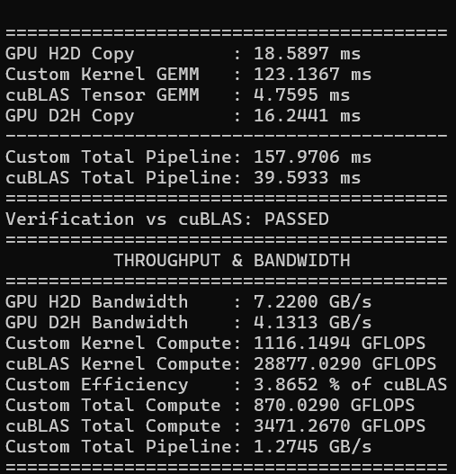
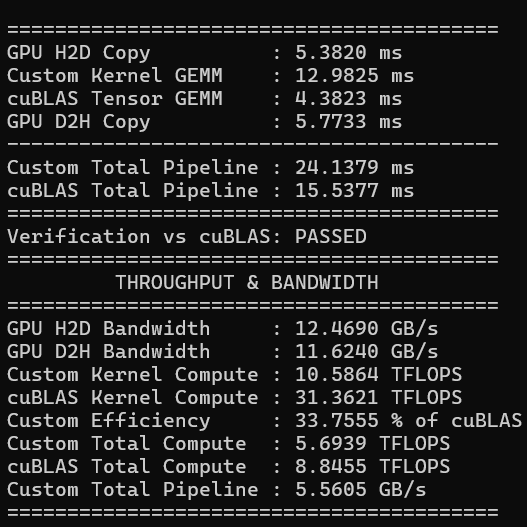
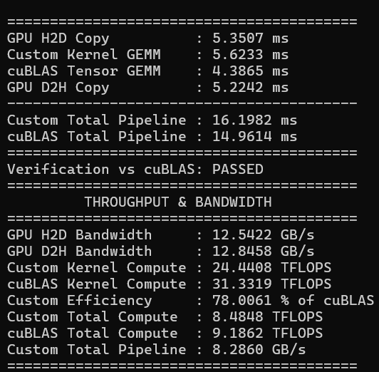
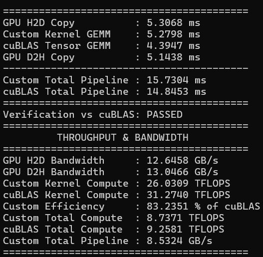
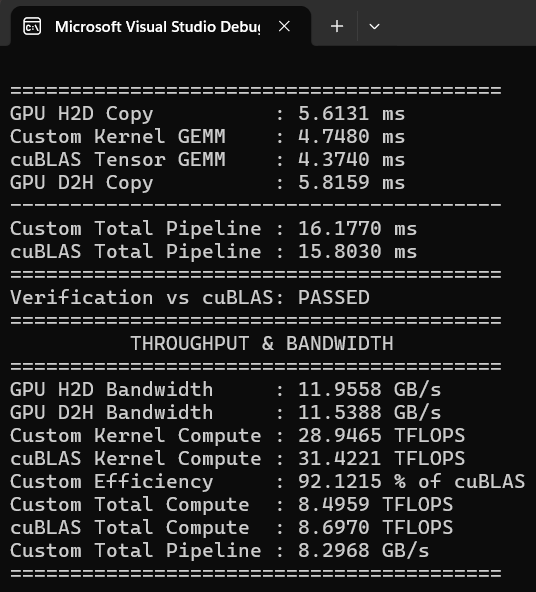

# Mission: CUBLAS

High-performance CUDA matrix multiplication (GEMM) benchmark and optimization pipeline aiming to match or surpass NVIDIA cuBLAS Tensor Core performance for 4096x4096 floating-point matrix operations on an RTX 4060 Mobile.

The project demonstrates an iterative engineering progression across 5 distinct kernel implementations—starting from a naive shared memory implementation in FP32 up to an asynchronous, multi-stage ring-buffered pipeline utilizing Tensor Cores (WMMA) and 128-bit memory instructions in FP16/FP32. The final optimization iteration achieves **92% of State of the Art cuBLAS Tensor Core performance**.

---

## Performance Overview

All benchmark metrics below represent operations on 4096x4096 matrices (M=4096, N=4096, K=4096).

| Version | Precision | Key Architectural Optimizations | Execution Time (ms) | Throughput (TFLOPS) | Throughput vs cuBLAS |
| :--- | :--- | :--- | :--- | :--- | :--- |
| **v0** | FP32 | Naive Shared Memory Tiling, Dynamic Boundary Checks | **`157.97 ms`** | **`1.11 TFLOPS`** | **`3.86`%** |
| **cuBLAS CUDA** | FP16/FP32 ||| **`6.21 TFLOPS`** |  |
| **v1** | FP16/FP32 | Tensor Core WMMA, 2x2 Spatial Warp Grid, Vectorized Loads | **`12.98 ms`** | **`10.58 TFLOPS`** | **`33.75`%** |
| **v2** | FP16/FP32 | Double-Buffered Pipelining, 128x128 Tile, 4x4 Warp Sub-Tiling | **`6.62 ms`** | **`24.44 TFLOPS`** | **`78.0`%** |
| **v3** | FP16/FP32 | 3-Stage Async Pipeline (`cp.async`), Padded SMEM Layout | **`5.27 ms`** | **`26.03 TFLOPS`** | **`83.23`%** |
| **v4** | FP16/FP32 | Coalesced 128-bit Vectorized Async Memory Loop Unrolling | **`4.74 ms`** | **`28.94 TFLOPS`** | **`92.12`%** |
| **cuBLAS Tensor** | FP16/FP32 || **`4.37 ms`** | **`31.42 TFLOPS`** | **`100`%** |

---

## Iterative Optimization Roadmap

### Version 0: Naive Shared Memory GEMM
* **Implementation Source:** `custom_matmul_v0.cuh`
* **Target Bottleneck:** Standard global memory access latency.
* **Optimizations Implemented:**
  * **Shared Memory Tiling:** Loads square matrix tiles into static CUDA `__shared__` memory buffers (`A` and `B` tiles) to reduce DRAM accesses.
  * **Global-to-Shared Cooperative Loading:** Maps standard thread indices (`threadIdx.x`, `threadIdx.y`) directly to tile coordinates for dynamic global memory fetching.
  * **Thread Block Synchronization:** Enforces `__syncthreads()` barrier calls prior to computation loops and between tile transitions to prevent data race conditions.
  * **Boundary Guarding:** Incorporates per-element conditional branch checks (`if (row < m && tiledCol < k)`) to support arbitrary non-power-of-two matrix sizes.

#### Performance Metrics & Analysis

* **Kernel Execution Time:** `123.13` ms
* **Compute Throughput:** `1.16` TFLOPS
* **Efficiency vs cuBLAS:** `3.86` %

---

### Version 1: Tensor Core Integration & 2D Warp Distribution
* **Implementation Source:** `tcore_custom_matmul_v1.cuh`
* **Target Bottleneck:** Scalar CUDA core ALU compute bound and FP32 floating point processing bandwidth.
* **Optimizations Implemented:**
  * **Hardware Tensor Core Activation:** Replaces standard scalar ALUs with NVIDIA Warp Matrix Multiply and Accumulate (`nvcuda::wmma`) primitives targeting FP16 inputs with FP32 accumulation.
  * **Spatial Warp Decomposition:** Deploys a 128-thread CTA structured as a 2x2 grid of warps, assigning individual $16 \times 16 \times 16$ tile computations to distinct warp IDs.
  * **Vectorized Memory Casts:** Utilizes `int2` reinterpret casting to issue 64-bit vector loads, packing multiple `half` elements into single instruction fetches.
  * **Pinned Host Allocation:** Replaces standard `malloc` with `cudaMallocHost` pinned memory allocations to maximize DMA transfers across the PCIe bus.

#### Performance Metrics & Analysis

* **Kernel Execution Time:** `12.98` ms
* **Compute Throughput:** `10.58` TFLOPS
* **Efficiency vs cuBLAS:** `33.75` %

---

### Version 2: Expanded Block Tiling & Double-Buffered Software Pipelining
* **Implementation Source:** `tcore_custom_matmul_v2.cuh`
* **Target Bottleneck:** High-latency `__syncthreads()` barriers stalling WMMA compute execution pipelines.
* **Optimizations Implemented:**
  * **Large Block Tiling ($128 \times 128$):** Scales block output footprint to $128 \times 128$, enabling a single CTA to compute 16 WMMA operations per tile step.
  * **4x4 Sub-Tile Register Accumulation:** Assigns a 4x4 matrix fragment array (`c_frag[4][4]`) to each warp, keeping 16 matrix tiles purely inside GPU register storage throughout the inner $K$-loop.
  * **Double-Buffered Shared Memory:** Implements a two-stage ping-pong buffer in shared memory (`StageBuffer stages[2]`), allowing asynchronous prefetching of iteration $k+1$ while computing iteration $k$.
  * **128-bit Global Accesses:** Enforces `int4` memory transactions across all global fetches, reading 8 `half` values per single vector memory instruction.

#### Performance Metrics & Analysis

* **Kernel Execution Time:** `5.62` ms
* **Compute Throughput:** `24.44` TFLOPS
* **Efficiency vs cuBLAS:** `78.0` %

---

### Version 3: Asynchronous Multi-Stage Ring Pipeline & Padding Layout
* **Implementation Source:** `tcore_custom_matmul_v3.cuh`
* **Target Bottleneck:** Shared memory bank conflicts and register pressure during double-buffered memory stalls.
* **Optimizations Implemented:**
  * **Hardware Asynchronous Copies (`cp.async`):** Uses Ampere+ CUDA C++ pipeline primitives (`cuda_pipeline.h` / `__pipeline_memcpy_async`) to transfer global memory directly into shared memory without wasting register files.
  * **3-Stage Ring-Buffered Pipeline:** Expands software pipeline stages from 2 to 3, completely decoupling memory load latency from active WMMA compute cycles.
  * **Conflict-Free Shared Memory Padding:** Adds explicit structural padding (`PADDING = 8`) to shared memory array dimensions (`16 + 8` and `128 + 8`), completely eliminating shared memory bank conflicts during WMMA matrix loads.
  * **Explicit Alignment:** Decorates shared memory data structures with `alignas(16)` attributes to satisfy 128-bit architectural bus alignment rules.

#### Performance Metrics & Analysis

* **Kernel Execution Time:** `5.27` ms
* **Compute Throughput:** `26.03` TFLOPS
* **Efficiency vs cuBLAS:** `83.23` %

---

### Version 4: Coalesced 128-bit Async Transfers & Unrolled Memory Loops
* **Implementation Source:** `tcore_custom_matmul_v4.cuh`
* **Target Bottleneck:** Non-coalesced memory access patterns and loop overhead in async transfer scheduling.
* **Optimizations Implemented:**
  * **Fully Coalesced Async Accesses:** Redesigns thread-to-address mapping logic for Matrix A and Matrix B async loads, guaranteeing 100% coalesced 128-bit reads across contiguous global memory addresses.
  * **Static Loop Unrolling (`#pragma unroll`):** Applies explicit unroll directives to all inner transfer loops, removing loop counter increment instructions and branch mispredictions.
  * **Optimized Pipeline Drain:** Reorganizes epilogue pipeline flushing cycles to maximize hardware execution unit utilization during final tile accumulation.
  * **Direct Accumulator Streaming:** Synchronizes WMMA fragments directly to global host-accessible destination pointers without intermediate conversion passes.

#### Performance Metrics & Analysis

* **Kernel Execution Time:** `4.74` ms
* **Compute Throughput:** `28.94` TFLOPS
* **Efficiency vs cuBLAS:** `92.12 %` of Peak cuBLAS Performance

---

## Educational CUDA Sample Kernels

To complement the GEMM optimization series, this repository provides educational CUDA implementations designed for learning fundamental GPU programming concepts:

* **Naive Matrix Multiplication**
* **Unified Matrix Multiplication**
* **Bitonic / Transposition Sort**
* **Basic Vector Addition**
* **Unified Vector Addition**
* **Tiled Matrix Multiplication**
* **Unified Tiled Matrix Multiplication**
* **CUBLAS CUDA Matrix Multiplication**
* **Tensor Core Naive Matrix Multipication**

---

## Build and Execution Guide

### Prerequisites
* **CUDA Toolkit:** v11.0 or higher (v11.8+ recommended for Ampere/Ada `cp.async` support)
* **Compiler:** `nvcc` with C++17 support
* **Hardware Requirements:** NVIDIA GPU supporting Compute Capability 7.0+ (Volta, Turing, Ampere, Ada Lovelace, or Hopper) for WMMA and Tensor Core operations.

### Compilation
Compile the suite using `nvcc` with `-O3` optimization flags:

```bash
nvcc -O3 -std=c++17 -lcublas main.cu -o mission_cublas